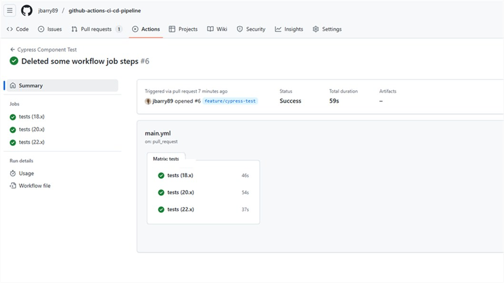
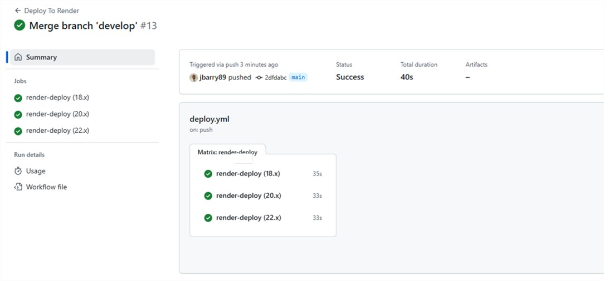

# Github-Actions-CI/CD-Pipeline

[](https://opensource.org/licenses/MIT)

## Table of Contents

- [Description](#description)
- [Installation](#installation)
- [Usage](#usage)
- [Contributing](#contributing)
- [Test](#test)
- [License](#license)
- [Questions](#questions)

## Description
This application is a MERN Stack application and streamline development workflow using a CI/CD pipeline in GitHub Actions to automate Cypress component testing on 'Pull Requests' to the develop branch and deploy changes to the main branch when merged.

 ## Installation
  To successfully run this application, these are the following installation dependencies requirements: 
  * Node.js
  * Express.js
  * React
  * MongoDB
  * Cypress
  * Mongoose
  * dotenv

  #### Set Up Environmental Variables
  In the `server` folder, rename the `.env.EXAMPLE` to `.env`.  Add your database connection string `MONGODB_URI` inside the `.env` file.

  ## Usage 
  Here is an example screenshot of the GitHub Action development workflows of a successful component and deployment tests.

  [Deployed Application on Render](https://github-actions-ci-cd-pipeline.onrender.com/)

  

  

  
  ## Contributing
  The following resources were used for development and debugging:
  * Stack Overflow
  * Class Activities
  * ChatGPT
  
  ## Test 
  Type the code below in the terminal, running each line of code separately.

  1. Install the Dependencies:
  ```bash
  npm install

  ```

  2. Build the Application:
  ```bash
  npm run build

  ```

  3. Seed the Database (Ensure MongoDB is installed before this step):
  ```bash
  npm run seed

  ```

  Start the Application  

  ``` bash 
  npm run start:dev

  ``` 

  **Run Cypress Component and E2E Testing** *(Test Suite runs in Headless mode):*
  On a separate Terminal run this code

  ``` bash 
  npm run test-component

  ``` 

  **Tutorial Walkthrough:** [GitHub Action CI/CD Pipeline Tutorial](https://gist.github.com/jbarry89/6ec26f39f62a1e236d310810b783bd50)
  

  ## License
  This project is Licensed under the MIT License.
  
  ## Questions
  Feel Free to contact me for any additional questions
  * GitHub: [jbarry89](https://github.com/jbarry89/)
  * Email: joelbarry8907@hotmail.com 